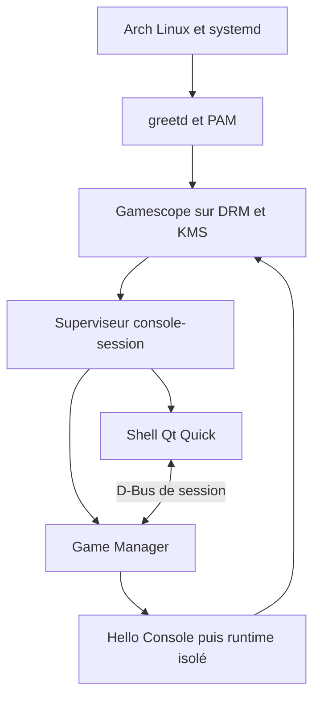

# Architecture de Console OS

Statut : proposition v0.1 et première tranche de prototype, 15 septembre 2026.
Nom de travail uniquement. Cible : PC x86_64 dédié, Arch Linux, un écran et un
jeu actif. Ni magasin, ni services en ligne, ni compatibilité Windows requis.

## 1. Deux produits, un contrat

**Console** : système installé, session graphique dédiée, shell, catalogue local,
runtime et services. **DevKit** : outils sur le poste développeur et agent
optionnel sur la console. Ils partagent le schéma de manifest, la version de
protocole et, plus tard, le format de package et le contrat de runtime.

Le prototype livré est un environnement local de développement. Il n'est pas
une image Retail sécurisée. Developer Mode et Retail Mode ne sont pas encore
implémentés : aucun commutateur visuel ne prétend activer ces protections.

## 2. Architecture de session

greetd ouvre une session PAM/logind pour un compte non privilégié. Gamescope
gère l'affichage et expose le socket Wayland à ses clients. Le superviseur
démarre le Game Manager dans cet environnement graphique puis le shell ;
il arrête l'ensemble quand le shell se termine. Cela évite qu'un service lancé
trop tôt récupère un WAYLAND_DISPLAY absent ou périmé.

Le lancement imbriqué dans un bureau existant est un outil de développement.
Le lancement depuis greetd vise une session autonome. Le chemin embedded,
la reprise après veille et le focus shell/jeu nécessitent une validation matérielle.
Le MVP masque le shell quand le processus démarre et le réaffiche à sa fin ;
ce n'est pas encore un overlay ni une politique de focus de compositor.

### Choix du compositor

| Option | Décision |
|---|---|
| Gamescope | Cible retenue : conçu pour les sessions de jeux, support Wayland/Xwayland et modes embedded/nested. Tester les pilotes et la politique multi-fenêtres. |
| Compositor général existant | Weston constitue une solution de diagnostic possible, pas une dépendance du produit livré. |
| wlroots | Bibliothèque pour écrire un compositor, pas un compositor prêt à utiliser. Trop de responsabilités à prendre maintenant. |
| Compositor personnalisé | Rejeté au MVP : DRM, input, focus, protocoles et reprise GPU seraient un projet à part entière. |

## 3. Comparaison UI et choix

| Technologie | Atouts pour ce projet | Coûts et réserves | Décision |
|---|---|---|---|
| Qt 6 / QML | Scène native, animations, focus, intégration Linux/D-Bus, UI déclarative | C++ à encadrer ; vérifier les licences de chaque module redistribué | Retenu |
| Flutter Linux | UI déclarative et animations, outillage homogène | Runtime Dart et intégration système/manette additionnelle | Non retenu |
| Rust + Slint | UI déclarative, intégration Rust, orientation embarquée | Vérifier widgets, accessibilité, backend et conditions de distribution nécessaires | Alternative crédible |
| Rust + Iced | Rust, modèle de messages explicite | Travail supplémentaire sur une expérience console et son outillage graphique | Non retenu |
| React + Tauri | Compétences web réutilisables, backend Rust | WebKitGTK sur Linux, couches supplémentaires et comportement GPU à tester | Non retenu |

Il ne s'agit pas d'un benchmark mémoire. Aucune valeur RAM/FPS n'est promise.
Mesurer RSS/PSS, latence input, frametimes et démarrage à froid sur le mini-PC
cible avant de figer un budget de performance.

La première tranche utilise C++20, Qt 6 et QML, avec CMake/CTest. Rust reste
le choix proposé pour le parseur de packages et l'updater privilégié futurs.
Le D-Bus versionné évite de lier l'UI à leur langage. Pas de pont Rust/C++ ni
de processus vide ajouté pour donner une apparence de microservices.

## 4. Processus et privilèges

| Composant | Rôle | Identité et état |
|---|---|---|
| greetd | Authentification Linux et création de session | Service système existant ; configuration exemple |
| Gamescope | DRM/KMS, surfaces Wayland/Xwayland | Compte de session et accès seat/logind ; pas de GUI root |
| console-session | Superviser shell et manager, arrêt commun | Compte de session ; script implémenté |
| console-shell | Home, bibliothèque, réglages, actions sémantiques | Compte de session ; implémenté |
| game-manager | Valider catalogue, lancer et surveiller un jeu | Compte de session ; implémenté |
| package-manager | Vérifier puis installer les packages | TODO ; parseur sans privilège, commit filesystem limité |
| user-service | Profils et données personnelles | TODO ; ne pas confondre profil joueur et compte Linux |
| controller-service | Mapping, hotplug, routage Home | TODO ; mapping sémantique préparé côté shell |
| storage-service | Quotas et volumes de jeux | TODO ; API étroite vers UDisks2 si nécessaire |
| network-service | Adaptateur vers NetworkManager | TODO ; ne pas réimplémenter Wi-Fi/DHCP |
| update-service | Images système vérifiées, health check | TODO ; composant privilégié distinct |
| devkit-service | Appairage et commandes développeur | TODO ; absent et aucun port ouvert au MVP |

BlueZ fournit le Bluetooth, PipeWire/WirePlumber l'audio, logind l'alimentation
et les sessions. Les futures opérations système utilisent leurs API avec une
politique polkit contrôlant l'utilisateur et la session active, jamais une règle
globale « autoriser tout ». Une fenêtre de profil n'est pas un verrouillage PAM.

## 5. IPC et cycle de vie

D-Bus convient à Linux et à Qt, permet introspection, erreurs et signaux. Un
socket Unix imposerait framing, reconnexion et sérialisation supplémentaires.
gRPC local ne justifie pas son poids pour trois commandes.

MVP : bus de session, service `org.consoleos.GameManager1`, objet
`/org/consoleos/GameManager1`, interface du même nom. Méthodes `ListGames`,
`Launch(id)`, `Stop(id)`, `Status`. Les réponses structurées sont des chaînes
JSON pour garder ce contrat initial simple ; les erreurs ont un code explicite.
Le shell utilise des appels asynchrones. Le manager ne reçoit ni commande shell,
ni chemin d'exécutable, ni UID arbitraire via son API.

Un seul jeu à la fois. États : stopped → starting → running → stopped ou failed.
La fin et le crash du processus rendent le shell visible. Stop envoie TERM puis
KILL après un délai. Ce prototype surveille le processus direct seulement : les
jeux qui détachent des enfants ne sont pas pris en charge avant les unités cgroup.

## 6. Catalogue et runtime

Chaque sous-dossier immédiat du catalogue contient `game.json` et son exécutable.
Schéma strict v1 : id reverse-DNS ASCII, nom, version SemVer simple, développeur,
exécutable relatif, runtime `native`, permissions vides, support manette booléen.
Manifest ≤ 64 Kio. Champs inconnus et runtime non pris en charge refusés.
Pas d'arguments libres ni de scripts d'installation. Liens symboliques et sortie
du dossier du jeu refusés pour le manifest, le dossier et l'exécutable.

Le catalogue est fourni par un chemin absolu au démarrage, pas par l'UI. Le
manager réévalue le manifest avant lancement. Cela ne supprime pas les courses
filesystem : le MVP suppose un catalogue de confiance non modifié pendant une
exécution. Le futur catalogue système sera écrit uniquement par l'installateur.

Pour le développement : données sous XDG_DATA_HOME/console-os/games/id,
configuration sous XDG_CONFIG_HOME/console-os/games/id et cache sous
XDG_CACHE_HOME/console-os/games/id. Les chemins XDG du processus jeu pointent
vers ces sous-dossiers ; CONSOLE_SAVE_PATH désigne son répertoire de sauvegarde.
Cette organisation n'est PAS une isolation : le processus possède encore les
droits du compte Linux. Aucun jeu inconnu ne doit être exécuté dans cette version.

Cible produit : payloads immuables sous `/var/lib/console-os/games/id/version`,
sauvegardes sous `/var/lib/console-os/users/user-id/saves/id`. Le broker déduit
le profil de la session authentifiée ; un jeu ne choisit pas le user-id.

Le runtime doit évoluer vers un sysroot versionné contenant l'ABI utilisateur
et les dépendances autorisées. Arch rolling release ne constitue pas une ABI SDK
stable. Tester SDL2/3, Vulkan/OpenGL et des exports Godot/Unity/Unreal individuellement ;
un binaire Linux n'est pas automatiquement compatible. Wine/Proton reste optionnel.

## 7. Packages et mises à jour

Proposition .gamepkg : enveloppe versionnée, manifest, inventaire SHA-256 des
fichiers et payload tar.zst. Signature Ed25519 détachée des octets exacts de
l'inventaire signé incluant le hash du manifest et le hash du payload. La
spécification binaire et la gestion des clés restent à finaliser en phase 3.

Vérifier une clé approuvée et la signature de l'enveloppe AVANT extraction.
L'extraction bornée rejette chemins absolus, `..`, doublons, symlinks, hardlinks,
devices, setuid, permissions excessives, archives décompressées trop grandes.
Installer dans staging sur le même filesystem, vérifier tous les hashes, fsync,
puis publier atomiquement. Pas de hooks fournis par un jeu. Un hash seul ne prouve
ni l'origine ni l'autorisation d'installation.

Game Update : métadonnées signées contenant id, version, hash, taille et runtime,
nouvelle version côte à côte, pointeur actif atomique, conservation précédente.
Les sauvegardes et leur migration ont leur propre politique ; revenir au binaire
précédent ne restaure pas nécessairement une sauvegarde compatible.

System Update : images construites en CI depuis un ensemble Arch figé, canaux
de diffusion et racines A/B en cible. Boot compté, marquage bon après health check,
retour automatique au slot antérieur. /var séparé et migrations réversibles.
Ne pas lancer pacman -Syu depuis la GUI. Archiso sert ultérieurement à l'installateur,
pas à résoudre à lui seul l'atomicité ou le rollback. Ni ISO ni updater dans ce MVP.

## 8. Console et DevKit

Le poste développeur compile Hello Console avec le sysroot cible, crée un package,
puis utilise consolectl. L'agent console n'écoute qu'en Developer Mode après une
activation locale authentifiée. Proposition : TLS mutuel, code d'appairage à
usage unique et empreinte vérifiée localement ; clés stockées hors payloads,
révocation explicite et fermeture des sessions au retour Retail.

Les commandes install/launch/stop/logs partagent les services internes. Le debug
est limité au processus du jeu dans son périmètre, sans shell root. Les builds
dev utilisent une autorité distincte et restent inaccessibles en Retail. La
transition Retail doit arrêter les jeux dev et purger l'accès distant, pas
seulement cacher un menu. Voir devkit.md et security.md.

## 9. Risques à lever avant une plateforme complète

| Risque | Validation / décision |
|---|---|
| Focus et Home pendant le jeu | Essai embedded, crash, retour shell ; broker input ou intégration compositor requis |
| GPU et veille | Matrice AMD/Intel/NVIDIA, HDMI audio, hotplug, changement résolution |
| Sandbox et périphériques | Tests d'évasion négatifs et fonctionnement Vulkan/audio/manette |
| Base Arch changeante | Référentiel de paquets figé et builds traçables, pas d'updates rolling directs |
| Clés compromises | Rotation, révocation, compteurs anti-rollback des métadonnées |
| Coupure électrique | Injection de pannes installation et A/B ; récupération hors ligne |
| Multi-profils | Séparation réelle et accès sauvegardes, pas simple préfixe de chemin |
| Distribution commerciale | Inventaire des licences et composants redistribués, noms propres originaux |

## Références primaires consultées

- Qt Quick : https://doc.qt.io/qt-6/qtquick-index.html
- Gamescope : https://github.com/ValveSoftware/gamescope
- greetd : https://man.archlinux.org/man/greetd.1.en
- D-Bus : https://dbus.freedesktop.org/doc/dbus-specification.html
- Flutter Linux : https://docs.flutter.dev/platform-integration/linux/building
- Slint : https://slint.dev/
- Iced : https://github.com/iced-rs/iced
- Tauri Linux/WebKitGTK : https://v2.tauri.app/develop/debug/linux-graphics/
- bubblewrap : https://github.com/containers/bubblewrap

Les choix, la roadmap et le format de package proposés ici sont nos décisions
d'architecture, pas des fonctionnalités garanties par ces projets.
