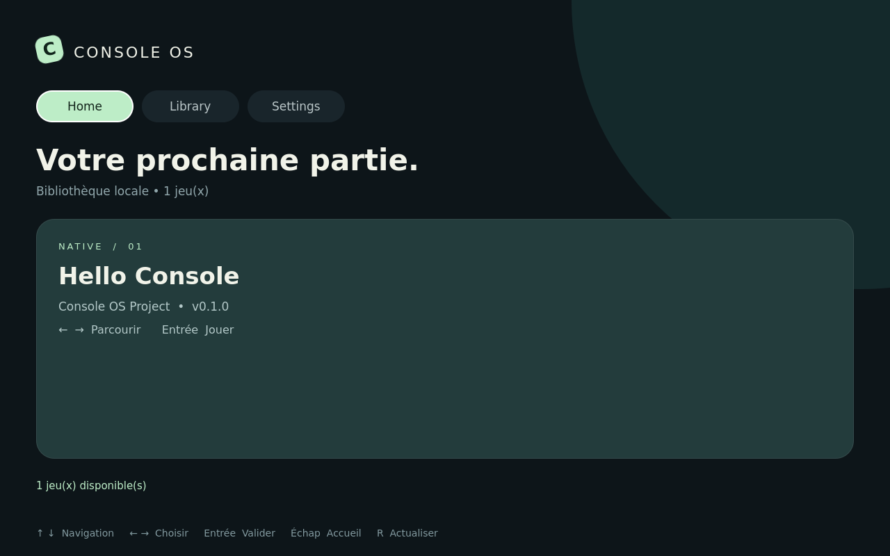

# Vérification du lot 0.1

Date : 15 septembre 2026. Environnement de génération : Ubuntu 24.04 x86_64,
GCC 13.3, SDK Qt 6.8.3, CMake 4.4.3. Ce n'est pas une machine Arch dédiée.
Les SDK et dépendances de vérification ont été placés hors du dépôt et ne sont
pas redistribués dans l'archive.

| Vérification | Résultat |
|---|---|
| Compilation C++/QML | Réussie pour console-shell, game-manager, hello-console et tests |
| Suite manifest | Réussie : 20 cas fonctionnels, plus initialisation/nettoyage QtTest |
| Suite manager | Réussie : catalogue, processus réel, double lancement, arrêt, sauvegardes, sortie normale, échec exécutable et suppression du binaire |
| Recette D-Bus interprocessus | Non exécutée : ignorée explicitement sous root ; environnement également restreint en sockets Unix |
| Refus root des deux programmes | Vérifié : code 1 et événement root_forbidden |
| QML shell avec fixture | Réussi hors écran : chargement, Home/Library/Settings, retour Home et transmission de l'ID de lancement |
| QML Hello Console | Chargement réussi sans avertissement |
| Binaire Hello Console | Démarrage et sortie smoke-test réussis, rendu logiciel hors écran |
| Rendu visuel shell | Capture 1280×800 inspectée ; données de fixture explicitement identifiées |
| Scripts/configuration | Syntaxe Bash, Python, JSON et TOML vérifiée |
| Boot Arch, greetd, Gamescope embedded | Non exécuté ; recette fournie dans bringup.md |
| GPU, manette et bouton Home global | Non validés ; backend manette encore TODO |
| Sandbox, packages signés, DevKit distant, updater | Non implémentés dans ce lot |

Résumé CTest : **2 suites réussies, 1 suite ignorée, 0 échec**. Ne pas interpréter
la ligne automatique « 100% tests passed » comme une validation de D-Bus ou du boot.

Les tests du moteur de cycle de vie appellent directement la classe Manager
avec des exécutables temporaires contrôlés. Ils ne passent pas par le point
d'entrée du daemon, lequel continue de refuser root sans exception de test.
La fixture QML ne constitue pas un service de remplacement dans le produit.

## Reproduire la vérification sur Arch

Exécuter les commandes du README avec un compte utilisateur normal. La suite
integration crée alors son propre bus D-Bus et doit passer. Puis suivre
bringup.md pour valider la chaîne graphique réelle. Les binaires de ce build
Ubuntu ne sont pas livrés : reconstruire depuis les sources sur la cible.

## Aperçu de l'interface

Image issue de la scène QML réelle, avec une fixture de catalogue, rendue hors
écran. Ce n'est pas une capture d'une console ayant démarré sous Arch.

